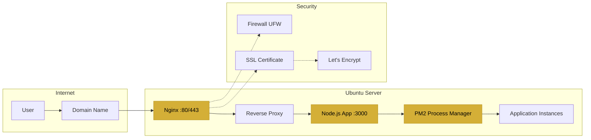
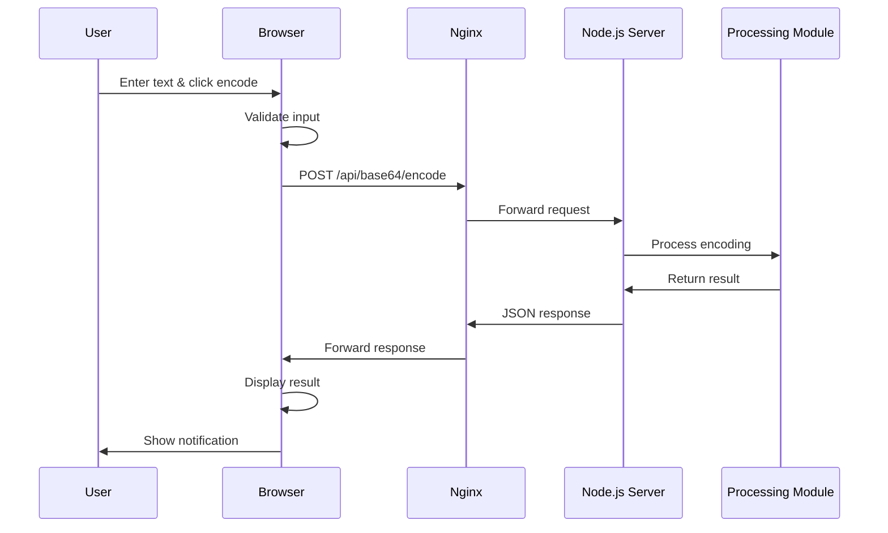
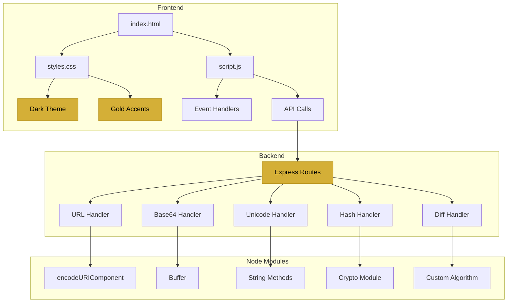
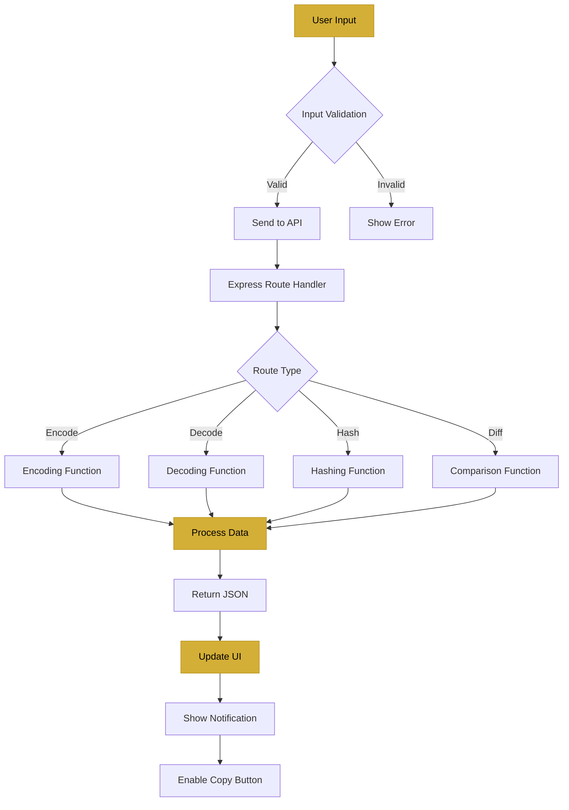
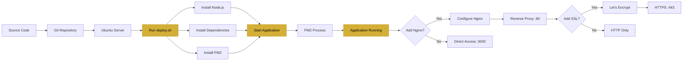
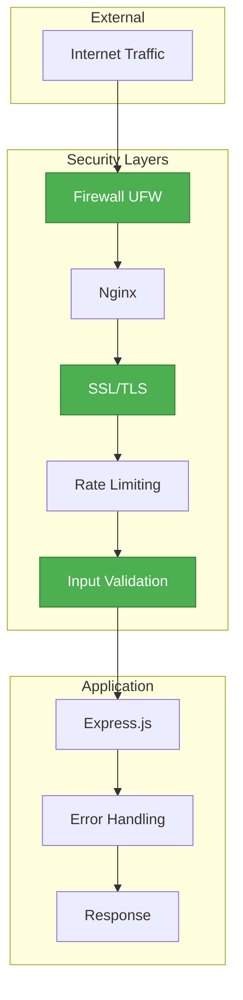
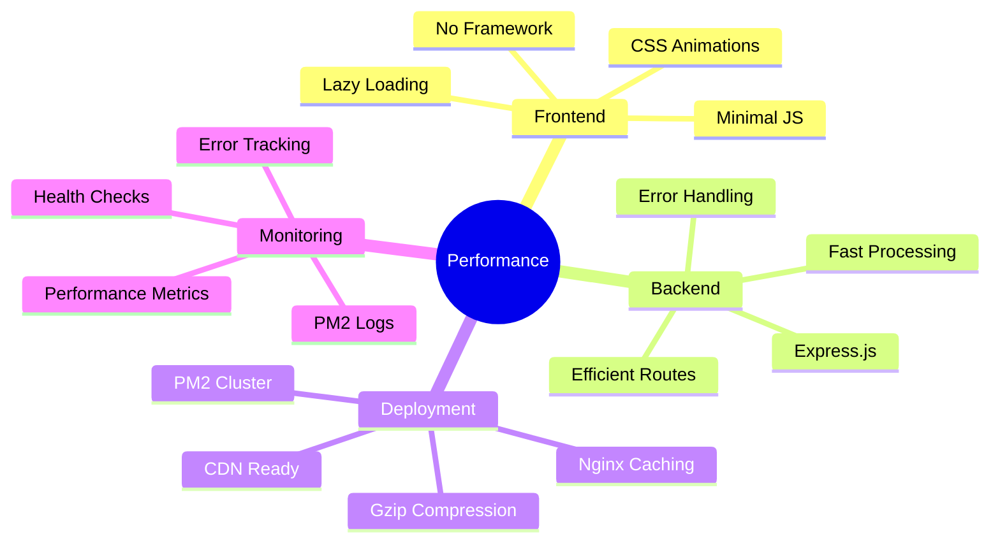

# System Architecture

## Architecture Diagram

```mermaid
graph TB
    subgraph "Client Layer"
        A[Web Browser] --> B[HTML/CSS/JS]
        B --> C[User Interface]
    end
    
    subgraph "Frontend Components"
        C --> D[URL Tool]
        C --> E[Base64 Tool]
        C --> F[Unicode Tool]
        C --> G[Hash Tool]
        C --> H[Diff Tool]
    end
    
    subgraph "API Layer"
        D --> I[/api/url/*]
        E --> J[/api/base64/*]
        F --> K[/api/unicode/*]
        G --> L[/api/md5 & /api/sha256]
        H --> M[/api/diff]
    end
    
    subgraph "Backend Server"
        I --> N[Express.js Server]
        J --> N
        K --> N
        L --> N
        M --> N
        N --> O[Node.js Runtime]
    end
    
    subgraph "Processing"
        O --> P[URL Encoding/Decoding]
        O --> Q[Base64 Encoding/Decoding]
        O --> R[Unicode Conversion]
        O --> S[Crypto Hashing]
        O --> T[Text Comparison]
    end
    
    style A fill:#d4af37,stroke:#b8941f,color:#000
    style N fill:#d4af37,stroke:#b8941f,color:#000
    style O fill:#d4af37,stroke:#b8941f,color:#000
```

## Deployment Architecture



## Request Flow



## Component Interaction



## File Structure

```
┌─────────────────────────────────────┐
│         Project Root                │
├─────────────────────────────────────┤
│                                     │
│  📄 server.js                       │
│  ├─ Express setup                   │
│  ├─ API routes                      │
│  └─ Server initialization           │
│                                     │
│  📄 package.json                    │
│  └─ Dependencies & scripts          │
│                                     │
│  📁 public/                         │
│  ├─ 📄 index.html                   │
│  │  ├─ Header                       │
│  │  ├─ Navigation                   │
│  │  ├─ Tool sections                │
│  │  └─ Footer                       │
│  │                                  │
│  ├─ 📄 styles.css                   │
│  │  ├─ Variables                    │
│  │  ├─ Layout                       │
│  │  ├─ Components                   │
│  │  ├─ Animations                   │
│  │  └─ Responsive                   │
│  │                                  │
│  └─ 📄 script.js                    │
│     ├─ Navigation                   │
│     ├─ API functions                │
│     ├─ Utilities                    │
│     └─ Event handlers               │
│                                     │
│  📄 deploy.sh                       │
│  └─ Automated deployment            │
│                                     │
│  📄 nginx.conf                      │
│  └─ Reverse proxy config            │
│                                     │
│  📄 Documentation                   │
│  ├─ README.md                       │
│  ├─ QUICKSTART.md                   │
│  ├─ DEPLOYMENT_CHECKLIST.md         │
│  ├─ PROJECT_SUMMARY.md              │
│  └─ ARCHITECTURE.md                 │
│                                     │
└─────────────────────────────────────┘
```

## Data Flow



## Technology Stack Layers

```
┌─────────────────────────────────────┐
│         Presentation Layer          │
│  HTML5 | CSS3 | Vanilla JavaScript  │
│  Dark Theme | Gold Accents          │
└─────────────────────────────────────┘
              ↕
┌─────────────────────────────────────┐
│         Application Layer           │
│  Express.js | RESTful API           │
│  Route Handlers | Middleware        │
└─────────────────────────────────────┘
              ↕
┌─────────────────────────────────────┐
│         Business Logic Layer        │
│  Encoding/Decoding | Hashing        │
│  Text Comparison | Validation       │
└─────────────────────────────────────┘
              ↕
┌─────────────────────────────────────┐
│         Runtime Layer               │
│  Node.js | Built-in Modules         │
│  Crypto | Buffer | String           │
└─────────────────────────────────────┘
```

## Deployment Flow



## Security Architecture



## Performance Optimization



## Scalability Options

```
Single Server (Current)
┌──────────────────┐
│   Ubuntu Server  │
│   ├─ Nginx       │
│   └─ Node.js     │
└──────────────────┘

Load Balanced (Future)
┌──────────────────┐
│  Load Balancer   │
└────────┬─────────┘
         │
    ┌────┴────┐
    │         │
┌───▼───┐ ┌──▼────┐
│Server1│ │Server2│
└───────┘ └───────┘

Containerized (Future)
┌──────────────────┐
│   Docker Host    │
│  ├─ Container 1  │
│  ├─ Container 2  │
│  └─ Container N  │
└──────────────────┘
```

---

This architecture provides:
- ✅ Scalability
- ✅ Maintainability
- ✅ Security
- ✅ Performance
- ✅ Reliability
